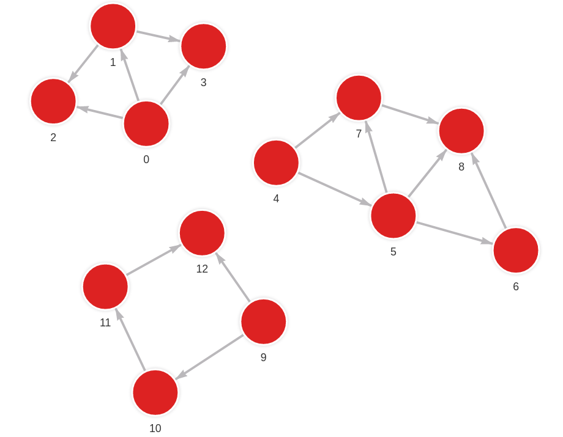
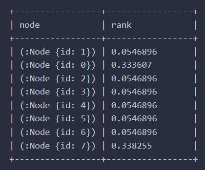

<h1 align="center">
  <br>
  <a href="https://github.com/memgraph/mage"> </a>
  <br>
  MAGE
  <br>
</h1>

<p align="center">
    <a href="https://github.com/memgraph/mage/actions" alt="Actions">
        
    </a>
    <a href="https://github.com/memgraph/mage/blob/main/LICENSE" alt="Licence">
        
    </a>
    <a href="https://docs.memgraph.com/mage/" alt="Documentation">
        
    </a>
    <a href="https://hub.docker.com/r/memgraph/memgraph-mage" alt="Documentation">
        
    </a>
    <a href="https://github.com/memgraph/mage" alt="Languages">
        
    </a>
    <a href="https://github.com/memgraph/mage/stargazers" alt="Stargazers">
        
    </a>
</p>

## Memgraph Advanced Graph Extensions :crystal_ball:

This open-source repository contains all available user-defined graph analytics modules and procedures that extend the Cypher query language, written by the team behind Memgraph and its users. You can find and contribute implementations of various algorithms in multiple programming languages, all runnable inside Memgraph. This project aims to give everyone the tools they need to tackle the most challenging graph problems.

Memgraph introduces the concept of **query modules**, user-defined procedures that extend the Cypher query language. These procedures are grouped into modules that can be loaded into Memgraph. How to run them can be seen on their official [documentation](https://docs.memgraph.com/memgraph/database-functionalities/query-modules/built-in-query-modules).

If you want more info about MAGE, check out the official [MAGE Documentation](https://docs.memgraph.com/mage/).

Furthermore, if you have an **algorithm proposition**, please fill in the survey on [**mage.memgraph.com**](https://mage.memgraph.com/).

## How to install?

To build and install MAGE query modules you will need: **Python3**, **Make**, **CMake**, **Clang** and **Rust**. Also, you will need a runnable Memgraph instance, whether locally or via Docker image. [Download](https://memgraph.com/download), and [install](https://docs.memgraph.com/memgraph/getting-started/installation/) **Memgraph**.

### Installing MAGE with Docker
#### Docker Hub

**1.** This command downloads and runs Memgraph image with **MAGE** algorithms:
```
docker run -p 7687:7687 memgraph/memgraph-mage
```

#### Local Build

**1.** Make sure to have `memgraph:latest` Docker image.
**2.** Build **MAGE** tagged Docker image.
```
docker build . -t memgraph-mage
```

**3.** Start Memgraph with the following command and enjoy **MAGE**:
```
docker run -p 7687:7687 memgraph-mage
```

### Installing MAGE locally
**1.** Run the `build` script. It will generate a `dist` directory with all the needed files. If you want to skip step 2)
you can add optional -p (--path) flag which represents where will contents of `dist` directory be copied.
```
python3 build (-p /usr/lib/memgraph/query_modules)
```

**2.** Copy the contents of the newly created `dist` directory to `/usr/lib/memgraph/query_modules`.
**3.** Start Memgraph and enjoy **MAGE**!

> Note that query modules are loaded into Memgraph on startup so if your instance was already running you will need to execute the following query to load them:
```
CALL mg.load_all();
```
If you want to find out more about loading query modules, visit [this guide](https://docs.memgraph.com/memgraph/database-functionalities/query-modules/load-call-query-modules).

## Example
If we have a graph that is broken into multiple components (left image), simple call this MAGE spell to check out which node is in which components (right image) →

```
// Create graph as on image below

CALL weakly_connected_components.get() YIELD node, component
RETURN node, component;
```

Graph input           |  MAGE output
:-------------------------:|:-------------------------:
  |  


## Testing the MAGE
To test that everything is built, loaded, and working correctly, a python script can be run. Make sure that the Memgraph instance with **MAGE** is up and running.
```
# Running unit tests for C++ and Python
python3 test_unit

# Running end-to-end tests
python3 test_e2e
```
## MAGE Spells

| Algorithms | Lang | Description |
| --- | --- | --- |
| [nxalg](python/nxalg.py) | Python| A module that provides NetworkX integration with Memgraph and implements many NetworkX algorithms |
| [graph_analyzer](python/graph_analyzer.py) | Python | This Graph Analyzer query module offers insights about the stored graph or a subgraph. |
| [distance_calculator](python/distance_calculator.py) | Python | Module for finding the geographical distance between two points defined with 'lng' and 'lat' coordinates. |
| [tsp](python/tsp.py) | Python | An algorithm for finding the shortest possible route that visits each vertex exactly once. |
| [set_cover](python/set_cover.py) | Python | The algorithm for finding minimum cost subcollection of sets that covers all elements of a universe. |
| [graph_coloring](python/graph_coloring.py) | Python | Algorithm for assigning labels to the graph elements subject to certain constraints. In this form, it is a way of coloring the graph vertices such that no two adjacent vertices are of the same color. |
| [vrp](python/vrp.py) | Python | Algorithm for finding the shortest route possible between the central depot and places to be visited. The algorithm can be solved with multiple vehicles that represent a visiting fleet.
| [union_find](python/union_find.py) | Python | A module with an algorithm that enables the user to check whether the given nodes belong to the same connected component. |
| [node_similartiy](python/node_similarity.py) | Python | A module that contains similarity measures for calculating the similarity between two nodes. |
| [weakly_connected_components](cpp/connectivity_module/connectivity_module.cpp) | C++ | A module that finds weakly connected components in a graph. |
| [biconnected_components](cpp/biconnected_components_module/biconnected_components_module.cpp) | C++ | Algorithm for calculating maximal biconnected subgraph. A biconnected subgraph is a subgraph with a property that if any vertex were to be removed, the graph will remain connected. |
| [bipartite_matching](cpp/bipartite_matching_module/bipartite_matching_module.cpp) | C++ | Algorithm for calculating maximum bipartite matching, where matching is a set of nodes chosen in such a way that no two edges share an endpoint. |
| [cycles](cpp/cycles_module/cycles_module.cpp) | C++ | Algorithm for detecting cycles on graphs |
| [bridges](cpp/bridges_module/bridges_module.cpp) | C++ | A bridge is an edge, which when deleted, increases the number of connected components. The goal of this algorithm is to detect edges that are bridges in a graph. |
| [betweenness centrality](cpp/betweenness_centrality_module/betweenness_centrality_module.cpp) | C++ | The betweenness centrality of a node is defined as the sum of the of all-pairs shortest paths that pass through the node divided by the number of all-pairs shortest paths in the graph. The algorithm has O(nm) time complexity. |
| [uuid](cpp/uuid_module/uuid_module.cpp) | C++ | A module that generates a new universally unique identifier (UUID). |

## Contributing

We encourage everyone to contribute with their own algorithm implementations and ideas. If you want to contribute or report a bug, please take a look at the [contributions guide](CONTRIBUTING.md).

## Code of Conduct

Everyone participating in this project is governed by the [Code of Conduct](CODE_OF_CONDUCT.md). By participating, you are expected to uphold this code. Please report unacceptable behavior to <tech@memgraph.com>.

## Feedback
Your feedback is always welcome and valuable to us. Please don't hesitate to post on our [Community Forum](https://discourse.memgraph.com/).
